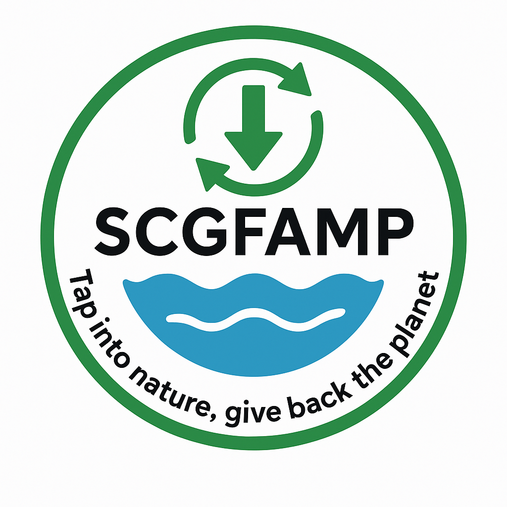
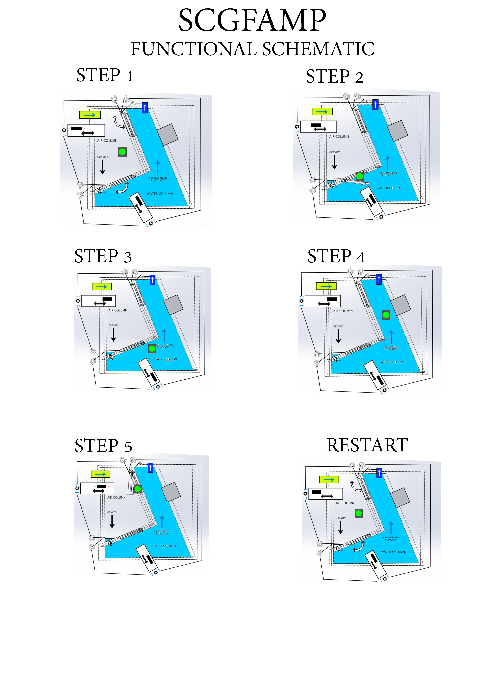

md > > 🔴 ARCHIVED – juillet 2025 : projet figé. Conservez à titre d’étude / fork.  
Des pistes d’optimisation ont été envisagées (ex : contrepoids, parois élastiques, mécanismes plus économes) mais restent à approfondir et expérimenter.

🔴 Archived Project (July 2025): This project is now frozen. It remains online for consultation, inspiration, or partial reuse.  
Some optimization ideas were considered (e.g., counterweights, elastic walls, more efficient mechanisms) but require further study and experimentation.

## 📘 Lessons & Reflections

- Too complex to scale at this stage
- Biomimetic inspiration useful but poorly mastered
- Difficulty balancing magnets, fluids, and energy
- Utopian but technically rewarding idea

**Language:** [English](#english) | [Français](#francais)

---

# SCGFAMP — [ARCHIVED]

  

<h1 align="center">SCGFAMP</h1>

<em>Tap into nature, give back the planet</em>

---

# SCGFAMP – Gravitoflotation Cycle with Passive Magnetic Assistance

SCGFAMP is a **freely accessible system for non-commercial use**, accompanied by a **dedicated commercial license**. It is not an open-source project in the strict sense (e.g., MIT, GPL), but rather a **pseudo-open system with clear usage boundaries**.

---

## 💡 Purpose
To provide a low-tech, scalable, modular technological foundation for energy or mechanical transfer, available for public use under non-commercial terms, and licensed for entities seeking private or strategic benefits.

---

## ⚙️ How It Works
The system operates at low pressure (< 1 bar), though the concept can be adapted to other pressure ranges. The cycle is based on:

- A **gravitational-flotation cyclic system** with **passive magnetic assistance**
- An **air intake** into the air column (from outside atmosphere, driven by pressure differential)
- An **air outlet (purge)** in the water column
- A mechanism to **expel water that entered the air column**, either through **incoming air pressure** or the motion of the falling mass
- A **mass** switching columns via a **trapdoor or valve system**
- The mass **falls in the air column** (gravity) and **rises in the water column** (buoyancy)
- A **buffer chamber** (or flexible membrane) compensates water volume fluctuations

The result is a **circular cycle of a mass** (gravity → trapdoor → buoyancy → trapdoor, in loop), which causes **fluid and air displacement**. This is regulated by the **air intake**, **air purge**, and **water expulsion**, maintaining global entropic balance.

---

## 📁 Documentation

All key documents of the SCGFAMP system are listed in their logical and numerical order:

1. **Low-Pressure Operation with Rigid Mass**  
   [`1-Circular-Operation_Low-Pressure-Rigid-Mass.md`](docs/english/1-Circular-Operation_Low-Pressure-Rigid-Mass.md)

2. **Functional Diagram**  
   `2-SCGFAMP FUNCTIONAL DIAGRAM.png` 

3. **Functional Schematic**  
   `3-SCGFAMP FUNCTIONAL SCHEMATIC.png` 

4. **Fluid and Gas Operation**  
   [`4-Fluid_And_Gas_Operation.md`](docs/english/4-Fluid_And_Gas_Operation.md)

5. **Biomimicry and Inspiration**  
   [`5-BIOMIMICRY_SCGFAMP-EN.md`](docs/english/5-BIOMIMICRY_SCGFAMP-EN.md)

6. **Grids Based on Basic Modules**  
   [`6-SCGFAMP_Grids_Based_On_Basic_Modules-EN.md`](docs/english/6-SCGFAMP_Grids_Based_On_Basic_Modules-EN.md)

7. **Use Cases and Modular Grids**  
   [`7-SCGFAMP_Grids_And_UseCases-EN.md`](docs/english/7-SCGFAMP_Grids_And_UseCases-EN.md)

8. **Energy Recovery Methods**  
   [`8-SCGFAMP_Energy_Recovery_Methods-EN.md`](docs/english/8-SCGFAMP_Energy_Recovery_Methods-EN.md)

9. **Regulatory Cheat Sheet**  
   [`9-SCGFAMP_Regulatory_CheatSheet_EN.md`](docs/english/9-SCGFAMP_Regulatory_CheatSheet_EN.md)

---

## 🔐 License & Usage Conditions

This project is released as **open-hardware**: you are free to **study**, **modify**, **repair** and **reproduce** it.

- **Personal / educational / non-commercial use** → Allowed ✅  
  (CERN-OHL-S 2.0 + CC BY-NC-SA 4.0)

- **Professional / commercial use** → requires a **dedicated license**  
  (to support development, cover R&D costs and avoid misuse)  
  👉 https://scgfamp.lemonsqueezy.com/buy/8430de49-9b31-4802-a4e6-0b24f7f69aad

> **Note:** Commercial-use rights are **automatically granted** if an active  
> GitHub sponsorship is maintained at the **€350/month tier (or higher)**.  
> If the sponsorship is downgraded or cancelled, commercial authorization **ends immediately**.  
> No retroactive or permanent rights are kept after sponsorship stops.

---

## 🔗 Official Website
The official website — [scgfamp.org](https://scgfamp.org) — redirects to the main GitHub repository.  
It serves as the central access point for documentation, licensing, and project updates.

---

## 📩 Contact
**Author:** Fabien Buisson  
**Email:** scgfamp@hotmail.com  
**Launch Year:** 2025  
**Current Version:** v1.0 – Theoretical & Open

---

**SCGFAMP is an experimental system designed to inspire decentralized low-tech innovation.**

If you're a researcher, maker, engineer, or policy designer: your feedback can shape the future of scalable biomimetic technologies.

> “What begins as an idea may become a loop the world turns on.”

### 🔬 Scientific Clarification

> ❗️**SCGFAMP is not a perpetual motion machine.**
>
> The system is based on natural physical cycles using gravity, buoyancy, and air/fluid regulation, within a closed environment.
>
> It requires external input (design configuration, occasional rebalancing, air intake from the atmosphere) and experiences energy losses (fluid friction, heat, mechanical resistance).
>
> The goal is not to create energy from nothing, but to **manage transfers and recoveries of mechanical/pressure energy** in an accessible, low-tech format.
>
> SCGFAMP is experimental, educational, and intended to stimulate biomimetic innovation — not to defy thermodynamic laws.

---

# SCGFAMP – Cycle Gravito-Flottant à Assistance Magnétique Passive

**SCGFAMP** est un système **librement accessible pour un usage non commercial**, accompagné d’une **licence commerciale dédiée**.  
Ce n’est pas un projet open source au sens strict (type MIT ou GPL), mais un **système pseudo-ouvert avec des limites d’usage clairement définies**.

---

## 💡 Objectif

Fournir une base technologique **low-tech, modulaire et scalable**, pour le transfert d’énergie ou de travail mécanique, accessible au public dans un cadre non commercial, et sous licence pour des entités privées, industrielles ou stratégiques.

---

## ⚙️ Fonctionnement

Le système fonctionne à **basse pression (< 1 bar)**, mais le concept peut être adapté à d'autres gammes. Le cycle repose sur :

- Un **système gravito-flottant cyclique** avec **assistance magnétique passive**
- Une **prise d’air atmosphérique** dans la colonne d’air
- Une **purge d’air** dans la colonne d’eau
- Un mécanisme permettant d’**expulser l’eau infiltrée dans la colonne d’air**
- Une **masse** alternant entre les colonnes via un **système de trappes ou clapets**
- La masse **tombe dans la colonne d’air** (gravité) puis **remonte dans la colonne d’eau** (flottabilité)
- Une **chambre tampon** (ou membrane) compense les variations de volume

🌀 Résultat : un **cycle circulaire** qui gère fluides, air et énergie mécaniquement et sans électricité.

---

## 📁 Documentation

| # | Titre | Lien |
|--|-------|------|
| 1 | Fonctionnement circulaire, basse pression, masse rigide | [Fonctionnement-Circulaire_Basse-Pression_Masse-Rigide-FR.md](docs/français/Fonctionnement-Circulaire_Basse-Pression_Masse-Rigide-FR.md) |
| 2 | Diagramme fonctionnel |  |
| 3 | Schéma fonctionnel simplifié |  |
| 4 | Fonctionnement fluide et gaz | [Fonctionnement_fluide_et_gaz.md](docs/français/Fonctionnement_fluide_et_gaz.md) |
| 5 | Biomimétisme & inspiration | [BIOMIMETISME-SCGFAMP-FR.md](docs/français/BIOMIMETISME-SCGFAMP-FR.md) |
| 6 | Grilles & modules de base | [SCGFAMP_Grids_Exemples_Modules_De_Base-FR.md](docs/français/SCGFAMP_Grids_Exemples_Modules_De_Base-FR.md) |
| 7 | Cas d’usage & grilles types | [SCGFAMP_UseCases_Visuel-FR.md](docs/français/SCGFAMP_UseCases_Visuel-FR.md) |
| 8 | Méthodes de récupération d’énergie | [SCGFAMP_Methodes_Recuperation_Energie-FR.md](docs/français/SCGFAMP_Methodes_Recuperation_Energie-FR.md) |
| 9 | Aide-mémoire réglementaire | [SCGFAMP_Aide_Memoire_Reglementaire.md](docs/français/SCGFAMP_Aide_Memoire_Reglementaire.md) |

---

## 🔐 Licence & Conditions d’usage

Ce projet est publié en **open-hardware** : vous êtes libre de l’**étudier**, le **modifier**, le **réparer** et le **reproduire**.

- **Usage personnel / éducatif / non-commercial** → Autorisé ✅  
  (CERN-OHL-S 2.0 + CC BY-NC-SA 4.0)

- **Usage professionnel / commercial** → nécessite une **licence dédiée**  
  (afin de soutenir le développement, couvrir les coûts R&D et éviter les abus)  
  👉 https://scgfamp.lemonsqueezy.com/buy/8430de49-9b31-4802-a4e6-0b24f7f69aad

> **Note :** Le droit d’usage commercial est **automatiquement accordé** si un
> sponsoring GitHub est actif au **palier de 350€/mois (ou supérieur)**.  
> Si le sponsoring est réduit ou annulé, l’autorisation commerciale **prend fin immédiatement**.  
> Aucun droit rétroactif ou permanent n’est conservé après l’arrêt du sponsoring.

---

## 📩 Contact

- **Auteur** : Fabien Buisson  
- **Mail** : scgfamp@hotmail.com  
- **Version** : v1.0  
- **Année** : 2025

---

## 🔬 Clarification scientifique

❗️**SCGFAMP n’est pas une machine à mouvement perpétuel.**

Le système repose sur des **cycles physiques naturels** utilisant la gravité, la flottabilité et la régulation air/fluides, dans un environnement fermé.

Il nécessite des **apports extérieurs** (configuration initiale, rééquilibrages occasionnels, prise d’air atmosphérique) et subit des **pertes d’énergie** (frottements des fluides, chaleur, résistances mécaniques).

👉 L’objectif n’est **pas de créer de l’énergie à partir de rien**, mais de **gérer le transfert et la récupération d’énergie mécanique ou de pression** dans un format low-tech et accessible.

**SCGFAMP est un outil expérimental et pédagogique**, destiné à stimuler l’innovation biomimétique — **pas à défier les lois de la thermodynamique.**

> _« Ce qui commence comme une idée peut devenir un cycle sur lequel le monde tourne. »_

SCGFAMP est un système expérimental conçu pour inspirer l'innovation low-tech décentralisée.

Si vous êtes chercheur, maker, ingénieur ou acteur des politiques publiques : **vos retours peuvent façonner l’avenir des technologies biomimétiques évolutives.**

>  
> Objectif : transfert d’énergie utile par des moyens simples, autonomes et accessibles.

---

